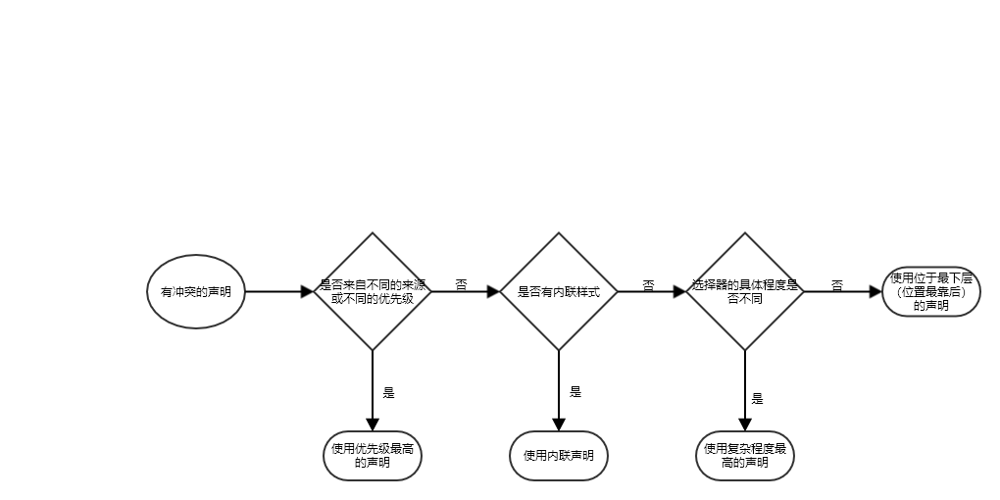

# Part 1 重温CSS基础

## `CSS` 中的 `C` ---  Cascading 层叠

> CSS中有着一套严格的规则。这套规则主要由三大因素所构成。
1. 样式的来源。
2. 样式的具体程度。
3. 样式的声明位置、顺序。

由这三张图，我们可以构成如下规则：

当然有时候实际情况会更复杂，这时候我们就需要有一套权重计算方式来确定样式的最高优先级。如果有`!important`默认只取此值

|选择器|ID|Class|标签|权重|
| ----------- | ----------- | ----------- | ----------- | ----------- |
|html body header h1|0|0|4|0, 0, 4|
|body header.page-header h1|0|1|3|0, 1, 3|
|.page-header .title|0|2|0|0, 2, 0|
|#page-title|1|0|0|1, 0, 0|
